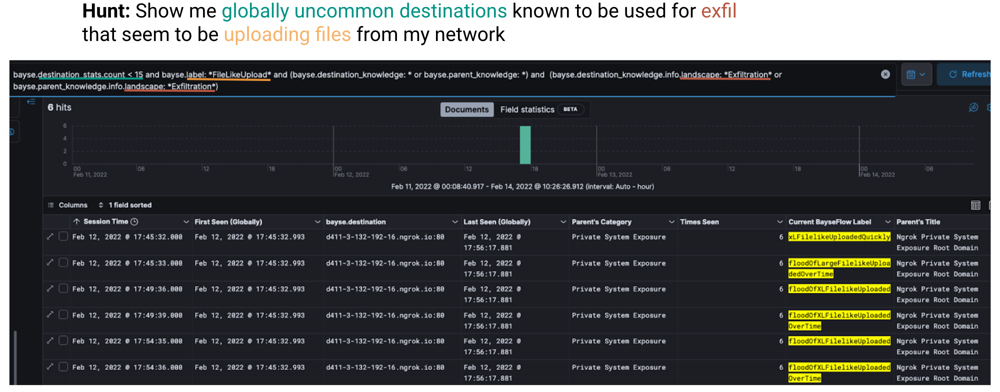

# End-to-End Demo with Bayse
The code in this repository is for demonstration purposes only and is not meant to be production functionality. If 
you need help getting Bayse set up in your production environment, please reach out to `sales@bayse.io`. 

## Initial Setup
This code will allow you to run an end-to-end demo with Bayse, but there are some prerequisites.

1. First, to use the labeling or interpret site functionality, you'll need to [register](https://www.bayse.io/register) 
   and request an API key. Once your API key is provisioned, you will need to reach out to `hello at bayse dot io` to request the labeling 
 functionality. This is a binary that will be compiled for your operating system type and architecture (i.e. `Ubuntu 
Linux x64`, `Mac OS X M1`), so please include that information in your email. The team at Bayse will then provide you 
with a binary.

2. If you have not already set up `bayse_tools`, please do so. Installation instructions can be found 
[here](https://pypi.org/project/bayse-tools/).

3. You will also need to install [bayse_summary](https://pypi.org/project/bayse-summary/).

4. Once everything above is accounted for, please unzip your labeling binary and update `config.py` to point to the 
   directory where it is located. By default we expect the labeling binary to be unzipped directly in this directory.

5. Next, create a Python file named `sensitive.py` and add the following information to it:
```
API_KEY = "<YOUR API KEY GOES HERE>"
```

At this point, you should be ready to demo the Bayse functionality!

## Performing an End-to-End (Labeling + Knowledge) Demo
If you want to use your own input files, please place them in a directory that you can access via the script. You 
can also use those provided in the `samples` directory for testing. The command below will show you how to use those.

To run the demo, use the following command:
`python3 demo.py --e2e samples --outputdirectory outputs`

If you'd like to avoid uploading any statistics about your input files to Bayse, you can add `--noupload` to the 
command. If you'd like timing information, add `-t` to the command.

The results will be stored in whichever output directory you specify (which defaults to `/tmp/bayseflows` if none is 
provided).


### Viewing the Results
To look at the JSON data created by running the end-to-en demo, open the file in your viewer of choice. The 
information contained in the files should capture:
* when the activity first started (`trafficDate`)
* the list of BayseFlows observed (`BayseFlows`)

For each of the BayseFlows, expect to see the following data:
* the underlying BayseFlow data (fields detailed [here](https://github.com/BayseIntelligence/bayse_tools#bayseflow-format))
* the label assigned to each BayseFlow (`label`)
* global statistics about the destination (`destination_stats`)
* which labels have been seen globally for this destination (`destination_flow_summary`)
* any knowledge found in Bayse about the destination (`destination_knowledge`) or its ancestor (`parent_knowledge`)

For example, here is the output of one of the BayseFlows from a sample:
```json
{
      "src": "10.10.220.5:52882",
      "dst": "content-autofill.googleapis.com:443",
      "destinationNameSource": "passive",
      "srcPkts": 11,
      "srcBytes": 1427,
      "dstPkts": 14,
      "dstBytes": 1539,
      "relativeStart": 48.159522,
      "protocolInformation": "TCP",
      "identifier": "153",
      "duration": 45.924555,
      "label": "trickleOfMediumInfoExchangedOverTime",
      "destination_knowledge": {
        "destination_nameport": "content-autofill.googleapis.com_TCP/443",
        "info": {
          "destination_data": "content-autofill.googleapis.com_TCP/443",
          "name": "content-autofill.googleapis.com",
          "protocol_name": "TCP",
          "port": 443,
          "owner_groups": [
            "Google, Inc./Alphabet, Inc."
          ],
          "landscape": [
            "Populates User Information"
          ],
          "concern_level": 1,
          "category": "User Information Storage",
          "title": "Input Form Exists on Nearby Site",
          "refs": [],
          "comments": [],
          "controllable_subdomains": false,
          "controllable_urls": false,
          "excluded_subdomains": [],
          "tags": [],
          "intended_purpose": "Used to store information that users have wish to reuse (such as credentials, payment information, and mailing addresses).",
          "last_modified": 1667490973,
          "abuse": "User Information Storage sites are not generally used maliciously by attackers. However, due to what they store, they do appear nearby potentially interesting activity.",
          "author": "david@bayse.io",
          "ttp_of_groups": [],
          "when_concerned": "If this destination appears nearby sites that are uncommon or untrustworthy (especially when they look similar to popular brands and/or your organization), the likelihood that it is a phishing attempt is high.",
          "all_children_inherit_knowledge": false,
          "report_abuse_how": "Unknown"
        }
      },
      "destination_stats": {
       "name": "content-autofill.googleapis.com",
       "first_searched": null,
       "times_searched": null,
       "first_observed": 1606423152.103841,
       "last_observed": 1669826877.2531362,
       "regions_seen": null,
       "count": 819,
       "observed_direct_children": null,
       "observed_direct_parent": "googleapis.com",
       "direct_children_with_knowledge": [],
       "direct_parent_with_knowledge": null
      },
      "destination_flow_summary": {
       "destination_nameport": "content-autofill.googleapis.com_TCP/443",
       "info": {
        "destination_data": "content-autofill.googleapis.com_TCP/443",
        "labels_observed": [
         "floodOfMediumFilelikeUploaded",
         "floodOfMediumInfoDownloaded",
         "floodOfMediumInfoExchanged",
         "floodOfSmallInfoDownloaded",
         "mediumInfoDownloadedQuickly",
         "mediumInfoExchangedQuickly",
         "noPayloadData",
         "smallInfoExchangedQuickly",
         "smallInfoUploadedQuickly",
         "streamOfMediumInfoDownloaded",
         "streamOfMediumInfoDownloadedOverTime",
         "streamOfMediumInfoExchanged",
         "streamOfMediumInfoExchangedOverTime",
         "streamOfSmallInfoDownloaded",
         "streamOfSmallInfoExchangedOverTime",
         "tcpKeepAlive",
         "trickleOfMediumFilelikeUploadedOverTime",
         "trickleOfMediumInfoDownloadedOverTime",
         "trickleOfMediumInfoExchangedOverTime",
         "trickleOfMediumInfoUploadedOverTime",
         "trickleOfSmallInfoDownloadedOverTime",
         "trickleOfSmallInfoExchangedOverTime",
         "trickleOfSmallInfoUploadedOverTime"
        ]
       }
      },
      "parent_knowledge": null
     }
```

### Next Steps
The information above is certainly useful, but it becomes infinitely more useful when it is pulled into your current 
workflow! For example, below is Bayse's data pulled into the Elastic Stack and used for hunting:



## Performing an Interpret Site Demo
To run the demo, use the following command:
`python3 demo.py --interpret  <URL or destination to interpret> --screenshot --details`

This tells Bayse to interpret the URL or destination you've passed to it, take a screenshot, and return all of the 
details about destinations that are seen when visiting the URL. For details on the kind of information that may be 
returned by this endpoint, please refer to our [API Docs](https://documenter.getpostman.com/view/23795814/2s8YRpGWoi#724e0559-5496-4460-a01e-4f7a71d6713c). 

## Getting Started

If you'd like to get started with harnessing the full potential of Bayse, please reach out to `sales@bayse.io`!